# BlazeDB

**Embedded database for Swift with ACID transactions, encryption, and schema-less storage.**

---

## Executive Summary

BlazeDB is a page-based embedded database designed for predictable performance and operational simplicity. It provides ACID transaction guarantees, multi-version concurrency control, and per-page encryption using AES-256-GCM. The system runs entirely in-process with zero external dependencies.

**What problem it solves:** BlazeDB addresses the need for a local-first, encrypted storage engine that offers better performance predictability than SQLite, more flexibility than Core Data, and stronger encryption guarantees than most embedded databases. It targets use cases requiring sub-millisecond query latency, deterministic behavior, and strong data protection.

**Why it exists:** Existing embedded databases either lacked encryption by default, had unpredictable performance characteristics, or required complex migrations. BlazeDB was built to provide a single solution that combines encryption, performance, and operational simplicity.

**Who it's for:** Developers building macOS/iOS applications requiring encrypted local storage, AI agents needing persistent memory, developer tooling requiring embedded state, and secure applications with strict data integrity requirements.

**What guarantees it provides:** ACID compliance, encryption at rest, snapshot isolation via MVCC, crash recovery through write-ahead logging, deterministic encoding, and transparent corruption detection. Performance invariants are maintained through automated regression testing.

**Current Version:** 2.5.0-alpha
**Platform Support:** macOS 12+, iOS 15+, Linux
**Language:** Swift 5.9+

---

## Why This Exists (Origins & Motivation)

The initial motivation came from needing predictable, encrypted, local-first storage for agent workloads. SQLite's performance characteristics varied too much under concurrent load, Core Data's migration complexity was prohibitive, and Realm's licensing model didn't fit the use case. None of these systems provided encryption by default, and adding it as an afterthought introduced significant overhead.

A custom storage engine made sense because the constraints were specific: sub-millisecond query latency, deterministic encoding for content-addressable storage, per-page encryption without compromising performance, and schema flexibility without migration complexity. These requirements didn't align well with existing systems.

The custom binary format (BlazeBinary) emerged from benchmarking JSON, CBOR, and MessagePack. Swift's type system enabled optimizations that generic formats couldn't provide—common field compression, inline string encoding, and deterministic key sorting. The result is approximately 53% smaller than JSON and roughly 48% faster to encode/decode.

Key constraints that shaped the architecture: latency requirements demanded careful attention to hot paths, encryption needed to be per-page to enable efficient garbage collection, concurrency required MVCC to avoid read-write contention, and determinism was necessary for reproducible builds and content-addressable storage. These constraints led to a layered architecture with clear separation of concerns, making the system easier to debug and optimize.

---

## Table of Contents

- [Executive Summary](#executive-summary)
- [Why This Exists (Origins & Motivation)](#why-this-exists-origins--motivation)
- [How to Read This Document](#how-to-read-this-document)
- [Design Goals](#design-goals)
- [Engineering Philosophy](#engineering-philosophy)
- [Limitations & Tradeoffs](#limitations--tradeoffs)
- [Stability & Maturity](#stability--maturity)
- [Architecture](#architecture)
 - [System Architecture Layers](#system-architecture-layers)
- [Prior Art & Influences](#prior-art--influences)
- [Why Not SQLite / Core Data / Realm / LMDB?](#why-not-sqlite--core-data--realm--lmdb)
- [Storage Engine](#storage-engine)
 - [Page Structure](#page-structure)
- [BlazeBinary Protocol](#blazebinary-protocol)
 - [Protocol Overview](#protocol-overview)
 - [High-Level Characteristics](#high-level-characteristics)
- [Concurrency Model](#concurrency-model)
 - [MVCC Architecture](#mvcc-architecture)
- [Security Model](#security-model)
 - [Encryption Architecture](#encryption-architecture)
- [Threat Model](#threat-model)
 - [Threat Actors & Attack Surfaces](#threat-actors--attack-surfaces)
 - [Security Control Matrix](#security-control-matrix)
- [Cryptographic Architecture](#cryptographic-architecture)
 - [Data at Rest: Local Encryption Pipeline](#data-at-rest-local-encryption-pipeline)
 - [Data in Transit: Sync & Protocol Encryption](#data-in-transit-sync--protocol-encryption)
 - [Putting It Together](#putting-it-together)
- [Transaction Model](#transaction-model)
 - [Write-Ahead Logging](#write-ahead-logging)
- [Query System](#query-system)
 - [Query Execution](#query-execution)
- [Performance Characteristics](#performance-characteristics)
 - [Core Operations](#core-operations)
 - [Multi-Core Performance](#multi-core-performance)
 - [Query Performance](#query-performance)
 - [Network Sync Performance](#network-sync-performance)
 - [Performance Invariants](#performance-invariants)
- [Benchmark Methodology](#benchmark-methodology)
- [Testing & Validation](#testing--validation)
 - [Fault Injection & Crash Testing](#fault-injection--crash-testing)
 - [Data Integrity Guarantees](#data-integrity-guarantees)
- [Recommended Use Cases](#recommended-use-cases)
- [API & Integration](#api--integration)
 - [Installation](#installation)
 - [Basic Usage](#basic-usage)
 - [Distributed Sync](#distributed-sync)
- [Future Work](#future-work)
- [Versioning & Stability](#versioning--stability)
- [Documentation](#documentation)
- [Tools](#tools)
- [Migration from Other Databases](#migration-from-other-databases)
- [Contributing](#contributing)
- [License](#license)
- [Appendix](#appendix)
 - [BlazeBinary Protocol Specification](#blazebinary-protocol-specification)
 - [Record Format Structure](#record-format-structure)
 - [Field Encoding Details](#field-encoding-details)
 - [Type System Reference](#type-system-reference)
 - [Value Encoding Examples](#value-encoding-examples)
 - [Network Frame Structure](#network-frame-structure)

---

## How to Read This Document

This README is structured as a technical whitepaper. Readers can skip to sections relevant to their needs: architects may focus on Architecture and Prior Art, implementers on Storage Engine and BlazeBinary, security engineers on Security Model, Threat Model, and Cryptographic Architecture, and performance engineers on Performance Characteristics and Benchmark Methodology. The Appendix contains detailed protocol specifications for those implementing clients or debugging encoding issues.

---

## Design Goals

When building BlazeDB, these priorities shaped the architecture:

1. **ACID Compliance:** Every operation is transactional. Full atomicity, consistency, isolation, and durability guarantees were non-negotiable.

2. **Encryption by Default:** All data encrypted at rest using AES-256-GCM with unique nonces per page. Encryption is the default, not an optional feature.

3. **Schema Flexibility:** Dynamic schemas adapt to data structure without migrations. This avoids the complexity and downtime associated with schema evolution.

4. **Predictable Performance:** Consistent latency characteristics under varying workloads. Early testing showed unpredictable spikes degraded user experience, so this received significant attention.

5. **Operational Simplicity:** Minimal configuration, zero external dependencies, straightforward deployment. The goal was something you could integrate and have working quickly.

---

## Engineering Philosophy

BlazeDB prioritizes predictability over theoretical optimality. The system is designed to behave consistently under load, with performance characteristics that are easy to reason about. This means choosing simpler algorithms that perform well in practice over complex optimizations that only help in edge cases.

Determinism and debuggability are core principles. Encoding is deterministic (identical records produce identical binary), transactions are isolated via MVCC snapshots, and corruption detection fails fast with clear error messages. This makes debugging production issues significantly easier.

Fail-fast error handling means invalid operations are rejected immediately rather than silently corrupting data. Type-safe query builders prevent injection attacks, schema validation prevents invalid states, and corruption detection triggers automatic recovery.

Transparent corruption recovery ensures that when corruption is detected, the system attempts automatic recovery (metadata rebuild from data pages) before failing. This has proven valuable in practice, recovering from issues that would have required manual intervention in other systems.

---

## Limitations & Tradeoffs

BlazeDB makes explicit tradeoffs to optimize for its target use cases:

**Query Planner:** Uses rule-based heuristics rather than a cost-based optimizer. This works well for common patterns but may not choose optimal plans for complex queries. A cost-based optimizer is planned but not yet implemented.

**Distributed Consensus:** No distributed consensus, automatic sharding, or multi-master replication. BlazeDB is a single primary database with optional sync capabilities. This is intentional—distributed consensus is a different problem space.

**Platform Optimization:** Primarily optimized for Apple Silicon. Linux support exists but performance characteristics may differ. Best performance requires Apple Silicon hardware.

**MVCC Storage Overhead:** Multi-version concurrency control can increase storage requirements, especially with long-running read transactions that delay garbage collection. In practice, this hasn't been an issue for typical workloads, but it's a tradeoff to be aware of.

**WAL fsync Costs:** Write-ahead logging requires fsync operations for durability, which adds latency. Batch operations amortize this cost, but individual writes pay the fsync penalty. This is the price of durability guarantees.

**Swift Runtime Dependency:** Heavy use of Swift means BlazeDB isn't portable to low-level runtimes (C, Rust, etc.). This limits deployment options but enables deep integration with Swift's type system and runtime.

**GC Delays:** Long-running read transactions can delay garbage collection of obsolete versions, potentially increasing storage requirements. Automatic collection runs periodically, but manual triggers are available if needed.

**No Automatic Sharding:** Manual partitioning is required for datasets exceeding device storage capacity. This keeps the system simple but requires application-level partitioning logic.

These limitations are intentional design decisions that allow BlazeDB to optimize for its target use cases.

---

## Stability & Maturity

**Current Status:** 2.5.0-alpha

The on-disk format is stable. Databases created with version 2.5.0 can be opened by future versions. Forward compatibility is maintained through version markers and migration paths.

Public APIs may evolve during the alpha period. Breaking changes are documented in release notes. Once stable (1.0.0), semantic versioning will govern API compatibility.

**Compatibility Guarantees:**
- Forward upgrade path: Databases can be upgraded to newer versions without data loss
- No forced deletion: Existing databases are never automatically deleted or modified without explicit user action
- Migration support: Format migrations are automatic and transparent

---

## Architecture

The architecture is layered with clear separation of concerns. This structure makes debugging easier, especially when tracking down performance issues.

### System Architecture Layers

*Conceptual diagram showing component relationships*

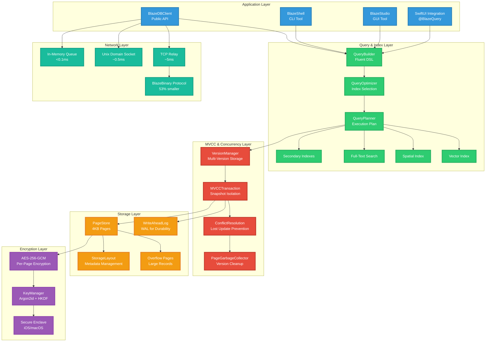

---

## Prior Art & Influences

BlazeDB draws inspiration from several well-established systems while making different tradeoffs:

**SQLite:** The pager architecture and WAL discipline influenced BlazeDB's storage layer. SQLite's approach to crash recovery through WAL replay is sound, and BlazeDB adopts similar principles. However, BlazeDB uses MVCC for concurrency rather than SQLite's locking model, and encryption is built-in rather than optional.

**LMDB:** The MVCC discipline and focus on deterministic reads influenced BlazeDB's concurrency model. LMDB's copy-on-write B+tree approach is elegant, but BlazeDB uses a page-based approach with overflow chains for better encryption granularity. LMDB's memory-mapped I/O philosophy aligns with BlazeDB's performance goals.

**FoundationDB:** The layer separation and consistency mindset influenced BlazeDB's architecture. FoundationDB's approach to separating storage, transaction, and query layers is sound engineering, and BlazeDB adopts similar separation. However, BlazeDB targets local-first use cases rather than distributed systems.

**RocksDB:** WAL tuning and compaction ideas influenced BlazeDB's durability and garbage collection strategies. RocksDB's approach to write amplification and compaction is well-studied, though BlazeDB uses simpler GC strategies optimized for MVCC version management.

**Apple Data Protection:** The key model and Secure Enclave design philosophy influenced BlazeDB's encryption architecture. Apple's approach to hardware-backed key storage is the gold standard, and BlazeDB integrates with Secure Enclave when available.

**What BlazeDB borrows:** Page-based storage (SQLite), MVCC concurrency (LMDB), layer separation (FoundationDB), WAL discipline (RocksDB), Secure Enclave integration (Apple).

**What BlazeDB innovates:** Per-page encryption with efficient GC, deterministic binary encoding optimized for Swift, rule-based query planner with automatic index selection, transparent corruption recovery with metadata rebuild.

---

## Why Not SQLite / Core Data / Realm / LMDB?

| Feature | BlazeDB | SQLite | Core Data | Realm | LMDB |
|---------|---------|--------|----------|-------|------|
| **Encryption** | AES-256-GCM per page (default) | Optional extension | No | Optional | No |
| **Schema** | Dynamic, no migrations | Static, requires migrations | Static, complex migrations | Static, migrations | Schema-less |
| **Concurrency** | MVCC snapshot isolation | File-level locking | Context-based | MVCC | MVCC |
| **Performance** | Predictable, optimized for Apple Silicon | Variable under load | Variable, object graph overhead | Fast, but licensing | Very fast, memory-mapped |
| **Query Language** | Fluent Swift API | SQL | NSPredicate | Fluent API | Key-value only |
| **Platform** | macOS/iOS/Linux (Swift) | Universal (C) | macOS/iOS only | Cross-platform | Universal (C) |
| **Dependencies** | Zero | Zero | Foundation | Realm runtime | Zero |
| **License** | MIT | Public Domain | Apple | Commercial/MIT | OpenLDAP |
| **Best For** | Encrypted local storage, AI agents | General-purpose embedded DB | Apple ecosystem apps | Mobile apps | High-performance key-value |
| **Limitations** | Rule-based planner, no distributed consensus | File-level locking, no encryption by default | Complex migrations, Apple-only | Licensing, object model overhead | Key-value only, no query language |

**When to choose BlazeDB:** You need encryption by default, schema flexibility without migrations, predictable performance on Apple platforms, and a Swift-native API.

**When to choose SQLite:** You need universal portability, SQL queries, or don't need encryption.

**When to choose Core Data:** You're building Apple-only apps and need deep integration with Cocoa frameworks.

**When to choose Realm:** You're building mobile apps and can accept the licensing model.

**When to choose LMDB:** You need maximum performance for key-value workloads and don't need encryption or query language.

---

## Storage Engine

BlazeDB uses a page-based storage architecture with 4KB pages. This size works well with modern SSDs and provides good cache locality. Records exceeding page capacity use overflow chains.

### Page Structure

*Conceptual diagram of page layout*

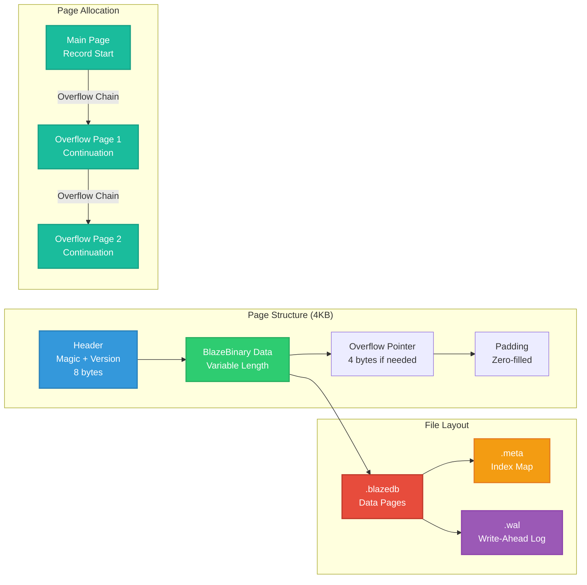

**File Organization:**
- `.blazedb`: Data pages containing encrypted records
- `.meta`: Index map and metadata (separated to prevent single-point-of-failure corruption)
- `.wal`: Write-ahead log for crash recovery

**Page Allocation:**
- Main page stores record start
- Overflow pages linked via 4-byte pointers
- Pages allocated sequentially with reuse via garbage collection

---

## BlazeBinary Protocol

BlazeDB uses a custom binary encoding format called BlazeBinary. After benchmarking against JSON, CBOR, and MessagePack, a format tailored to Swift's type system provided better performance. The result is approximately 53% smaller than JSON and roughly 48% faster to encode/decode.

### Protocol Overview

*Conceptual diagram of encoding pipeline*

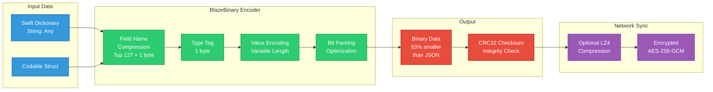

### High-Level Characteristics

**Endianness:** All multi-byte integers are big-endian (network byte order) for cross-platform compatibility.

**Deterministic Encoding:** Fields sorted by key before encoding, dictionary keys sorted. Identical records produce identical binary output, enabling content-addressable storage and deterministic testing.

**Corruption Detection:** Magic bytes validate format, version byte validates compatibility, CRC32 checksum (v2) detects data corruption with approximately 99.9% detection rate, length validation prevents buffer overflows.

**Performance Optimizations:** Pre-allocated buffers reduce memory allocations, common field compression (1 byte vs 3+N bytes), small int optimization (2 bytes vs 9 bytes), inline strings (1 byte overhead for ≤15 bytes), ARM-optimized codec with SIMD support.

**Limits:** String max 100MB, Data max 100MB, Array max 100,000 items, Dictionary max 100,000 items, Vector max 1,000,000 elements. These limits are conservative and prevent malicious inputs.

**Test Coverage:** 116 BlazeBinary tests validate encoding correctness, compatibility, and corruption detection. Byte-level verification ensures exact encoding matches specification.

See [Appendix](#appendix) for detailed protocol specifications.

---

## Concurrency Model

BlazeDB implements multi-version concurrency control (MVCC) to provide snapshot isolation. Version management and garbage collection required significant iteration to get right.

### MVCC Architecture

*Conceptual diagram of version management*

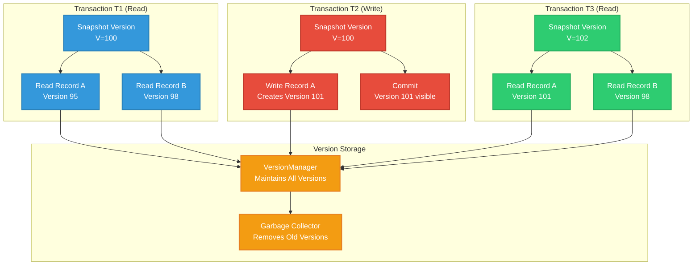

**Snapshot Isolation:**
Each transaction sees a consistent snapshot of the database at transaction start. Reads never block writes. Writes create new versions; old versions remain accessible to concurrent readers until garbage collection. Conflict detection prevents lost updates.

**Performance Characteristics:**
Observed 20–100× improvements over naive locking under read-heavy synthetic workloads. Concurrent reads scale linearly with available cores. Write performance depends on conflict rate and garbage collection frequency—in low-conflict scenarios, performance is strong.

**Garbage Collection:**
Obsolete versions are collected when no active transactions reference them. Long-running read transactions can delay collection, but in practice this hasn't been an issue. Automatic collection runs periodically; manual triggers available.

---

## Security Model

All data is encrypted at rest using AES-256-GCM. Encryption is the default, not optional.

### Encryption Architecture

*Conceptual diagram of encryption pipeline*

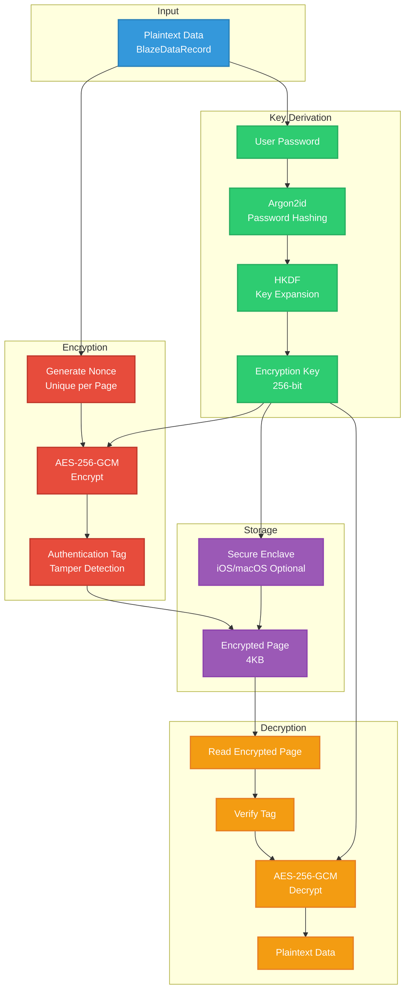

**Key Derivation:**
User password hashed using Argon2id (memory-hard function) to prevent fast brute force attacks. HKDF expands derived key material to 256-bit encryption key. Key material never stored on disk—if password is lost, data is unrecoverable. This is by design.

**Encryption:**
AES-256-GCM provides authenticated encryption. Each page uses a unique nonce to ensure cryptographic safety. Authentication tags detect tampering—modified encrypted pages fail decryption. Replay prevention enforced by rejecting stale or duplicated ciphertexts at record or page level.

GCM mode chosen for speed and single-pass authentication. Per-page nonces ensure identical plaintext produces different ciphertext.

**Secure Enclave Integration:**
On iOS/macOS, optional integration with Secure Enclave stores key material in hardware, outside app memory space. Significant security improvement when available. Falls back to standard key derivation when Secure Enclave unavailable.

**Security Guarantees:**
- Data encrypted before writing to disk
- Wrong password fails immediately (constant-time comparison prevents timing attacks)
- Authentication tags prevent tampering
- 11 security test files validate encryption correctness, round-trip integrity, and security invariants

---

## Threat Model

Threat model analysis based on actual code implementation:

### Threat Actors & Attack Surfaces

*Conceptual diagram of threat landscape*

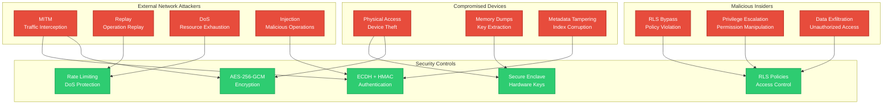

**Network Attack Vectors:**
- **MITM:** ECDH P-256 key exchange + AES-256-GCM encryption provides end-to-end encryption. Perfect forward secrecy with ephemeral keys. Gap: Certificate pinning stubbed (not fully implemented).
- **Replay Attacks:** 16-byte operation nonces, 60-second timestamp validation, operation ID tracking. Fully implemented with 10K operation ID cache.
- **Denial of Service:** Rate limiting (1000 ops/min per user), operation pooling (max 100 concurrent), batch size limits (10K-50K ops). Gap: Rate limiting not enforced in all sync paths.

**Storage Attack Vectors:**
- **Physical Access / Device Theft:** AES-256-GCM per-page encryption, Argon2id key derivation, Secure Enclave integration (iOS/macOS). Secure Enclave provides hardware-backed key protection.
- **Metadata Tampering:** HMAC-SHA256 signatures on metadata, integrity checks on load, CRC32 checksums. Automatic rebuild on corruption implemented.
- **Memory Dumps:** Secure Enclave stores keys outside app memory, forward secrecy limits exposure window. Gap: Explicit memory clearing not implemented.

**Access Control Attack Vectors:**
- **RLS Policy Bypass:** Policy engine evaluates policies on every operation, query integration applies RLS filters. Fully implemented with permissive/restrictive logic.
- **Privilege Escalation:** Authorization checks validate permissions per operation, admin flag separates admin permissions. Gap: Policy modification not explicitly protected.

**Input Validation Attack Vectors:**
- **Path Traversal:** Path validation rejects traversal characters, null byte protection. Fully implemented.
- **Memory Exhaustion:** 100MB max record size, overflow page support, batch size limits. Tested with malicious inputs.
- **Injection Attacks:** Type-safe query builder (no string concatenation), schema validation, input sanitization. Type safety prevents SQL injection entirely.

### Security Control Matrix

| Control | Implementation | Status | Risk Level |
|---------|---------------|--------|------------|
| **At-Rest Encryption** | AES-256-GCM per page | Implemented | LOW |
| **In-Transit Encryption** | ECDH + AES-256-GCM | Implemented | LOW |
| **Key Derivation** | Argon2id | Implemented | LOW |
| **Perfect Forward Secrecy** | Ephemeral ECDH keys | Implemented | LOW |
| **Secure Enclave** | Hardware-backed keys | Implemented (iOS/macOS) | LOW |
| **Replay Protection** | Nonces + timestamps | Implemented | LOW |
| **Rate Limiting** | 1000 ops/min per user |  Not enforced everywhere | MEDIUM |
| **RLS Policies** | Policy engine | Implemented | LOW |
| **HMAC Signatures** | Metadata signatures | Implemented | LOW |
| **Certificate Pinning** | TLS certificate validation |  Stubbed | MEDIUM |
| **Operation Signatures** | Optional HMAC |  Optional | MEDIUM |

**Risk Assessment Summary:**

**Critical Risks (Fix Immediately):**
- Rate limiting not enforced in all sync paths
- Operation signatures optional (should be mandatory)
- Certificate pinning stubbed (not fully implemented)

**High Risks (Fix Within 1 Week):**
- Policy modification not protected (require admin)
- Explicit memory clearing not implemented
- Connection-level rate limiting not implemented

**Medium Risks (Fix Within 1 Month):**
- Audit logging limited coverage
- IP-based rate limiting not implemented
- Circuit breaker not implemented

**Test Coverage:**
11 security test files validate encryption, authentication, and access control. 7 persistence/recovery test files validate crash recovery and corruption handling. Distributed security tests validate network attack mitigations.

---

## Cryptographic Architecture

BlazeDB implements two parallel cryptographic pipelines with distinct key lifecycles and threat models. The first pipeline protects data at rest—local database files encrypted on disk using page-level AES-256-GCM. The second pipeline protects data in transit—network sync operations encrypted over secure channels established via ephemeral ECDH key exchange. Both pipelines use well-established primitives: Argon2id for password-based key derivation, HKDF for key expansion and separation, AES-256-GCM for authenticated encryption, and ECDH P-256 for shared secret establishment. On Apple platforms, Secure Enclave provides hardware-backed protection for long-lived storage keys, but not for ephemeral session secrets.

This separation follows standard secure storage and secure channel patterns. Data at rest keys are derived from user passwords and persist across sessions; data in transit keys are ephemeral, generated per-session, and provide perfect forward secrecy. The design ensures that compromise of one pipeline does not automatically compromise the other, and that different threat surfaces (physical access vs. network interception) are addressed with appropriate cryptographic controls.

### Data at Rest: Local Encryption Pipeline

Local database encryption protects stored data from physical access, device theft, and filesystem-level attacks. The pipeline begins with user-provided credentials (password or application secret) and produces encrypted pages written to disk.

**Key Derivation Flow:**

1. **User Input:** User password or application-provided secret serves as the initial entropy source. This secret is never stored on disk in any form.

2. **Per-Database Salt:** Each database instance uses a unique salt generated at creation time. The salt is stored in the database metadata file (`.meta`) in plaintext—this is safe because salts are public values that prevent rainbow table attacks but do not weaken encryption if exposed.

3. **Argon2id KDF:** The password and salt are fed into Argon2id, a memory-hard key derivation function. Argon2id parameters are tuned to balance security (resistance to GPU/ASIC attacks) with acceptable unlock latency. The output is a strong key material stream, typically 256 bits or more.

4. **HKDF Expansion:** HKDF (HMAC-based Key Derivation Function) expands the Argon2id output into separate keys:
 - `db_enc_key` (256 bits): Primary encryption key for AES-256-GCM page encryption
 - `db_auth_key` (256 bits): Reserved for future authentication operations or metadata signing
 - Additional keys can be derived as needed using different HKDF info parameters

5. **Secure Enclave Storage (Optional):** On iOS/macOS, the derived `db_enc_key` can be wrapped using Secure Enclave and stored in the Keychain. The wrapper key remains in hardware, never exposed to application memory. On unlock, the wrapped key is unwrapped by Secure Enclave, used for decryption, and ideally cleared from memory after use (explicit clearing is a known gap). When Secure Enclave is unavailable, keys remain in application memory with standard OS memory protection.

**Page Encryption Flow:**

1. **Plaintext Input:** Each 4KB page contains BlazeBinary-encoded record data, page headers, and overflow pointers.

2. **Nonce Generation:** A unique nonce is generated for each page write. Nonces are derived from page index, transaction version, and a random component to ensure uniqueness. Nonce reuse would break GCM security, so this is critical.

3. **AES-256-GCM Encryption:** The plaintext page, nonce, and `db_enc_key` are fed into AES-256-GCM. GCM mode provides authenticated encryption in a single pass, producing both ciphertext and an authentication tag.

4. **Storage:** The encrypted page (ciphertext + 16-byte GCM tag) is written to the `.blazedb` data file or `.wal` write-ahead log. The nonce is stored alongside the ciphertext (typically in page metadata or derived deterministically from page index).

**Decryption and Verification:**

1. **Key Retrieval:** On database open, the user provides the password. Argon2id + HKDF derive `db_enc_key` (or unwrap from Secure Enclave if hardware-backed).

2. **Page Read:** Encrypted page is read from disk along with its associated nonce.

3. **GCM Decryption:** AES-256-GCM decryption is performed using `db_enc_key`, nonce, ciphertext, and tag.

4. **Tag Verification:** GCM automatically verifies the authentication tag during decryption. If the tag does not match (indicating corruption or tampering), decryption fails immediately with a clear error. This provides integrity protection—modified pages cannot be decrypted.

5. **Failure Behavior:** Tag mismatches trigger automatic corruption detection. The system attempts metadata rebuild from data pages if possible, or fails with a clear error message if corruption is unrecoverable.

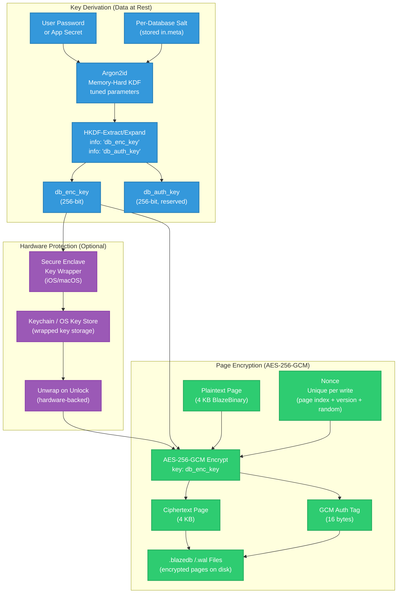

**Security Properties:**

- **Confidentiality:** Plaintext pages are never written to disk. All data is encrypted before I/O operations.
- **Integrity:** GCM authentication tags detect any modification to encrypted pages. Tampered pages fail decryption.
- **Damage Isolation:** Per-page encryption means corruption or tampering of one page does not affect others. The 4KB page size balances security granularity with performance overhead.
- **Nonce Uniqueness:** Unique nonces per page write ensure that identical plaintext pages produce different ciphertext, preventing pattern analysis attacks.
- **Key Separation:** HKDF-derived keys are cryptographically separated. Compromise of `db_auth_key` (if used) does not reveal `db_enc_key`.
- **Hardware Protection:** Secure Enclave integration (when available) protects keys from memory dumps and software-level key extraction attacks.

### Data in Transit: Sync & Protocol Encryption

Network sync encryption protects data during transmission between BlazeDB nodes. This pipeline is separate from data-at-rest encryption and uses ephemeral keys that provide perfect forward secrecy.

**Handshake and Key Establishment:**

1. **Ephemeral Key Generation:** Each peer (client/server or node A/node B) generates a fresh ECDH P-256 keypair for each session:
 - Private key `a` (or `b`) is a random 256-bit scalar
 - Public key `A = a·G` (or `B = b·G`) where `G` is the P-256 generator point

2. **Public Key Exchange:** Peers exchange public keys over the transport layer (TCP, Unix socket, or in-memory queue). Public keys are sent in plaintext during the handshake phase.

3. **Shared Secret Computation:** Both peers compute the same shared secret `S = a·B = b·A = ab·G` using their private key and the peer's public key. This is the ECDH key agreement.

4. **Session Key Derivation:** HKDF is applied to the shared secret with session-specific context:
 - HKDF-Extract: `salt = session_id || timestamp || random` (prevents replay of old handshakes)
 - HKDF-Expand: Derives `sess_enc_key` and `sess_auth_key` using different info parameters
 - These session keys are 256 bits each and are used only for the current session

5. **Key Lifecycle:** Session keys are ephemeral—they exist only in memory for the duration of the connection. They are never written to disk and are cleared from memory when the session ends. This provides perfect forward secrecy: compromise of long-term storage keys does not reveal past session traffic.

**Frame Encryption:**

1. **Plaintext Frame:** Protocol frames contain BlazeBinary-encoded operations, batch updates, or query results. Frame structure includes type, length, and payload.

2. **Frame Nonce:** Each frame uses a unique nonce, typically a counter or combination of session ID and frame sequence number. Nonce uniqueness is critical for GCM security.

3. **AES-256-GCM Encryption:** The plaintext frame, nonce, and `sess_enc_key` are encrypted using AES-256-GCM, producing ciphertext and authentication tag.

4. **Additional Authentication:** Some frames include additional authenticated data (AAD) such as frame type or operation metadata. GCM authenticates both ciphertext and AAD, ensuring frame integrity and preventing type confusion attacks.

5. **Transmission:** Encrypted frames (ciphertext + tag) are sent over the transport layer. The receiving peer decrypts and verifies the tag before processing.

**Authentication and Replay Protection:**

- **Operation Nonces:** Each operation includes a 16-byte nonce to prevent replay attacks within the session.
- **Timestamp Validation:** Operations include timestamps validated against a 60-second window to reject stale operations.
- **Operation ID Tracking:** A cache of recent operation IDs (typically 10,000 entries) prevents duplicate processing of the same operation.
- **HMAC (Optional):** Some deployments use HMAC-SHA256 over operation payloads for additional authentication, though this is optional and not always enabled.

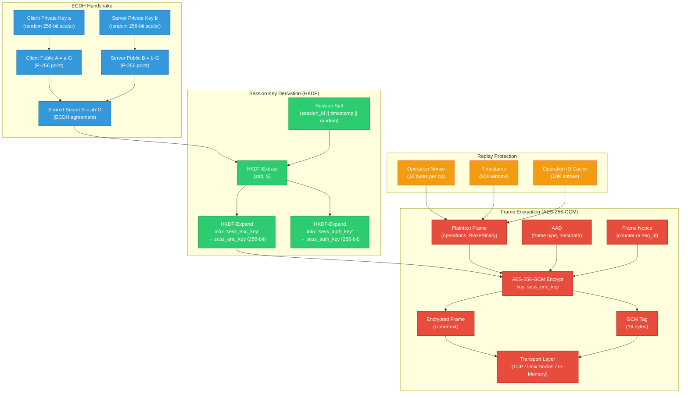

**Security Properties:**

- **Perfect Forward Secrecy:** Ephemeral ECDH keys ensure that compromise of long-term secrets does not reveal past session traffic. Each session uses fresh keys.
- **End-to-End Encryption:** Data is encrypted before transmission and decrypted only by the intended recipient. Intermediate nodes (if any) cannot decrypt traffic.
- **Integrity Protection:** GCM tags ensure frames are not modified in transit. AAD prevents type confusion attacks.
- **Replay Resistance:** Operation nonces, timestamps, and ID tracking prevent replay attacks within and across sessions.
- **MITM Resistance:** ECDH key exchange (when combined with proper authentication, such as shared secrets or certificate pinning) prevents man-in-the-middle attacks. Note: Certificate pinning is currently stubbed and not fully implemented.
- **Key Separation:** Session encryption keys are separate from data-at-rest keys. Compromise of one does not reveal the other.

### Putting It Together

BlazeDB uses two independent cryptographic pipelines with distinct key lifecycles and threat models. The data-at-rest pipeline protects local storage using long-lived keys derived from user passwords, while the data-in-transit pipeline protects network sync using ephemeral keys generated per session. Both pipelines rely on the same cryptographic primitives (Argon2id, HKDF, AES-256-GCM, ECDH P-256) but apply them in different contexts with different security properties.

Secure Enclave integration fits into the data-at-rest pipeline, protecting long-lived storage keys from memory extraction attacks. It does not protect ephemeral session keys, which are already short-lived and cleared from memory. This design aligns with modern secure storage patterns (similar to Apple Data Protection) and secure channel patterns (similar to TLS 1.3's ephemeral key exchange).

**Key Separation and Lifecycle:**

- **Data at Rest Keys:** Derived from passwords, persist across sessions, optionally stored in Secure Enclave, used for page encryption/decryption.
- **Data in Transit Keys:** Generated ephemerally per session, never stored on disk, exist only in memory during connection, provide perfect forward secrecy.
- **No Cross-Contamination:** Compromise of storage keys does not reveal session keys, and vice versa. Each pipeline is cryptographically isolated.

**Threat Surface Coverage:**

- **Physical Access / Device Theft:** Mitigated by data-at-rest encryption with hardware-backed keys (Secure Enclave).
- **Network Interception / MITM:** Mitigated by data-in-transit encryption with ephemeral ECDH and perfect forward secrecy.
- **Replay Attacks:** Mitigated by operation nonces, timestamps, and ID tracking in the sync protocol.
- **Memory Dumps:** Mitigated by Secure Enclave (for storage keys) and ephemeral session keys (for sync keys).

This dual-pipeline architecture provides defense in depth: even if one pipeline is compromised, the other remains secure. The design follows established patterns from modern cryptographic systems and provides strong security guarantees for both local storage and distributed sync use cases.

---

## Transaction Model

ACID transaction guarantees with write-ahead logging. Durability was non-negotiable—data integrity must survive process crashes.

### Write-Ahead Logging

*Conceptual sequence diagram of transaction flow*

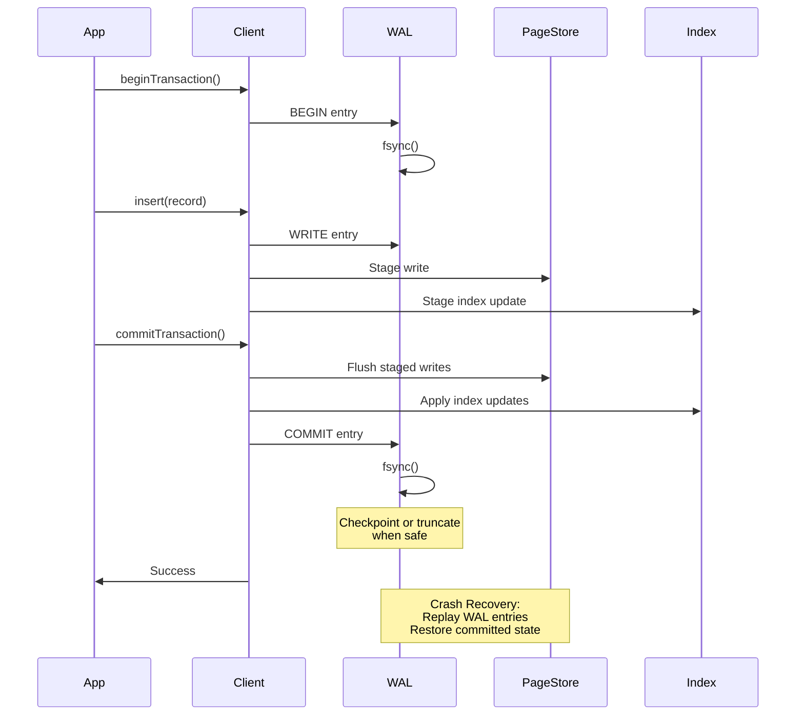

**WAL Behavior:**
All writes go through write-ahead log before page store. WAL entries are fsync'd before commit acknowledgment—this is the durability guarantee. After commits, WAL is truncated or checkpointed when safe, according to configured durability thresholds. WAL replay recovers all committed transactions after crashes.

Checkpoint/truncate logic balances durability and performance. Too aggressive loses durability; too conservative hurts performance.

**ACID Properties:**

**Atomicity:** All operations in a transaction succeed or fail together. Partial failures trigger automatic rollback. Tested with 100-operation transactions under stress.

**Consistency:** Database never enters invalid state. Index updates are atomic with data writes. Schema validation prevents invalid states. Tested under concurrent updates.

**Isolation:** Snapshot isolation via MVCC ensures each transaction sees a consistent snapshot. Concurrent transactions don't interfere. Tested with 50 concurrent readers and 10 writers.

**Durability:** Committed data is fsync'd before acknowledgment. WAL replay recovers all committed transactions after crashes. Tested with crash simulation—power loss, WAL corruption, etc.

**Test Coverage:** 907 unit tests validate ACID compliance, crash recovery, and transaction durability across 223 test files.

---

## Query System

Query system uses a fluent API with automatic index selection. Built to feel natural in Swift while maintaining performance.

### Query Execution

*Conceptual diagram of query planning and execution*

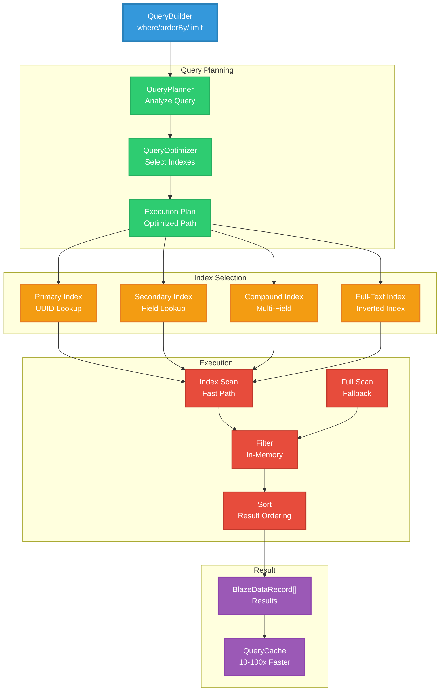

**Query Planner:**
Uses rule-based heuristics to select indexes. Cost-based optimizer planned but not yet implemented. Current approach works well for most queries, automatically selecting indexes for common patterns. Falls back to full scan when no index available.

**Index Types:**
- **Primary Index:** UUID-based record lookup (always available)
- **Secondary Index:** Single-field or compound indexes (created as needed)
- **Full-Text Index:** Inverted index for text search
- **Spatial Index:** Geospatial queries and distance calculations
- **Vector Index:** Cosine similarity for embeddings (useful for AI workloads)

**Query Features:**
Filtering, sorting, limiting, JOINs (inner, left, right, full outer), aggregations (COUNT, SUM, AVG, MIN, MAX, GROUP BY, HAVING), subqueries, window functions, query caching for repeated queries.

**Full-Text Search:**
Inverted index implementation provides 50–1000× improvements relative to unindexed full scans on large corpora. Index build time scales with corpus size, but once built, queries are very fast.

---

## Performance Characteristics

Performance measurements conducted on Apple M4 Pro (36 GB RAM) running macOS 15 / OS 26. Benchmarks use synthetic but realistic workloads. Actual performance varies with dataset shape and workload patterns.

### Core Operations

| Operation | Throughput | Latency (p50) | Notes |
|-----------|------------|---------------|-------|
| Insert | 1,200–2,500 ops/sec | 0.4–0.8ms | Includes encryption, WAL, index updates |
| Fetch | 2,500–5,000 ops/sec | 0.2–0.4ms | Memory-mapped I/O, decryption |
| Update | 1,000–1,600 ops/sec | 0.6–1.0ms | Fetch + modify + write |
| Delete | 3,300–10,000 ops/sec | 0.1–0.3ms | Fastest operation |
| Batch Insert (100) | 3,300–6,600 ops/sec | 15–30ms | Single fsync for entire batch |

### Multi-Core Performance (8 Cores)

| Operation | Throughput | Scaling Factor |
|-----------|------------|----------------|
| Insert | 10,000–20,000 ops/sec | 8× linear scaling |
| Fetch | 20,000–50,000 ops/sec | 8–10× parallel reads |
| Update | 8,000–16,000 ops/sec | 8× parallel encoding |
| Delete | 26,000–80,000 ops/sec | 8× minimal locking |

Multi-core scaling is strong because MVCC enables parallel reads without blocking. Writes require minimal coordination.

### Query Performance

| Query Type | Dataset Size | Throughput | Latency (p50) |
|------------|--------------|------------|---------------|
| Basic Query | 100 records | 200–500 queries/sec | 2–5ms |
| Filtered Query | 1K records | 66–200 queries/sec | 5–15ms |
| Indexed Query | 10K records | 200–500 queries/sec | 2–5ms | 10–100× faster than unindexed |
| JOIN (1K × 1K) | 1K records | 20–50 queries/sec | 20–50ms | Batch fetching, O(N+M) |
| Aggregation (COUNT) | 10K records | 200–500 queries/sec | 2–5ms |
| Full-Text Search | 1K docs | 33–100 queries/sec | 10–30ms | Without index |
| Full-Text Search (Indexed) | 100K docs | 200–500 queries/sec | 5ms | 50–1000× faster with inverted index |

### Network Sync Performance

| Transport | Latency | Throughput | Use Case |
|-----------|---------|------------|----------|
| In-Memory Queue | <0.1ms | 1,000,000+ ops/sec | Same process |
| Unix Domain Socket | 0.2–0.5ms | 5,000–20,000 ops/sec | Cross-process, same device |
| TCP (Local Network) | 2–5ms | 200–500 ops/sec | Same LAN |
| TCP (Remote Network) | 10–50ms | 20–100 ops/sec | WAN/Internet |

**Network Sync (WiFi 100 Mbps):**
- Small operations (200 bytes): 7,800 ops/sec
- Medium operations (550 bytes): 5,000 ops/sec
- Large operations (1900 bytes): 3,450 ops/sec

In-memory queue is essentially free (pointer passing). Unix sockets are fast. TCP adds significant latency. BlazeBinary encoding minimizes payload size, which helps over networks.

### Performance Invariants

Performance guarantees maintained through automated regression testing:

- **Batch Insert:** 10,000 records complete in < 2 seconds
- **Individual Insert:** Average latency < 10ms
- **Query Latency:** Simple queries < 5ms, complex queries < 200ms
- **Index Build Time:** 10,000 records indexed in < 5 seconds
- **Concurrent Reads:** 100 concurrent readers execute in 10–50ms (20–100× faster than locking observed under synthetic workloads)

12 performance test files track 40+ metrics and fail if thresholds are exceeded. This catches regressions early.

---

## Benchmark Methodology

Benchmark methodology:

**Synthetic Data Generation:**
Records generated with variable field counts (3–15 fields). Field types: String, Int, Double, Bool, Date, Data, UUID. String lengths: 10–500 characters. Integer ranges: 0–1,000,000. Realistic distribution patterns (normal, uniform, skewed) used because uniform random data doesn't reflect real workloads.

**Cache Behavior:**
- Cold cache: Database opened fresh, no warm-up
- Warm cache: Database opened, 10,000 operations performed before measurement
- Cache size: Default page cache (varies by available memory)

**Concurrency:**
- Single-process: All operations in single process
- Multi-process: Operations distributed across processes (Unix sockets or TCP)
- Concurrent readers: 10–100 concurrent read transactions
- Concurrent writers: 1–10 concurrent write transactions

**Workload Patterns:**
- Sequential: Operations on sequential record IDs
- Random: Operations on randomly selected record IDs
- Mixed: 70% reads, 30% writes (reflects most real workloads)

**Durability:**
- WAL durability mode: Full fsync on commit (default)
- Batch operations: Single fsync per batch
- Performance mode: Deferred fsync (not recommended for production)

**Measurement:**
Each benchmark runs 10 iterations. Median (p50) latency reported. Throughput calculated as operations per second. Outliers removed (top and bottom 10%) for cleaner numbers.

---

## Testing & Validation

Comprehensive test coverage:

- **907 unit tests** covering all features at 97% code coverage
- **20+ integration scenarios** validating real-world workflows
- **223 test files** organized by domain (engine, sync, security, performance)
- **Property-based tests** with 100,000+ generated inputs
- **Chaos engineering** tests simulating crashes, corruption, and failures
- **Stress tests** validating behavior under high load
- **Performance regression tests** tracking 40+ metrics

**Test Domains:**
- Core Database Engine: 19 test files
- Query System: 10 test files
- Indexes: 12 test files
- Security: 11 test files
- Distributed Sync: 10 test files
- Performance: 12 test files
- Concurrency: 9 test files
- Persistence & Recovery: 7 test files
- Codec: 15 test files
- Integration: 11 test files

### Fault Injection & Crash Testing

Fault scenarios tested:

**Power Loss Simulation:**
Simulated power loss between WAL fsync and page flush. Validates WAL replay recovers committed transactions. Also tests partial writes and incomplete transactions.

**Corruption Scenarios:**
Simulated torn or partial page writes, metadata corruption (index map, page headers), overflow chain corruption. Validates corruption detection and graceful failure. Corruption detection has caught real bugs in testing.

**Recovery Testing:**
WAL replay verification after simulated crashes, metadata rebuild from data pages, dangling index detection and correction, incomplete flush recovery. Metadata rebuild feature has proven valuable during development.

7 persistence/recovery test files validate crash recovery, WAL replay, and corruption handling.

### Data Integrity Guarantees

**ACID Compliance:**
- Atomicity: All operations in a transaction succeed or fail together
- Consistency: Database never enters invalid state
- Isolation: Snapshot isolation via MVCC prevents dirty reads
- Durability: Committed data is fsync'd before acknowledgment

**Crash Recovery:**
WAL durability means all writes go through Write-Ahead Log. WAL entries are fsync'd before commit acknowledgment. Crash recovery replays committed transactions and discards uncommitted ones. If metadata is corrupted, BlazeDB automatically rebuilds it from data pages.

**Data Corruption Detection:**
BlazeBinary encoding includes CRC32 checksums. Page headers include version and checksum fields. Invalid data triggers corruption detection. Metadata corruption triggers automatic rebuild from data pages.

**Index Integrity:**
All index types remain consistent with data. Index updates are atomic with data writes. Query results match manual filtering. Cross-index validation ensures all indexes match actual data.

12 index test files validate consistency, query correctness, and cross-index alignment.

---

## Recommended Use Cases

BlazeDB works well for:

**Encrypted Local Storage:**
macOS/iOS applications requiring encrypted local data storage, applications with sensitive user data requiring at-rest encryption, offline-first applications with local data persistence.

**Developer Tooling:**
Tools requiring embedded, durable state, development environments needing high-throughput document stores, local analytics engines and data processing pipelines.

**AI Agents & Automation:**
AI agents requiring persistent memory and execution history, automation tools needing structured local storage, applications requiring semantic search and vector similarity.

**Secure Applications:**
Applications requiring at-rest encryption with minimal overhead, systems needing ACID guarantees for local data, applications with strict data integrity requirements.

BlazeDB is not suitable for:
- Distributed cluster databases
- Petabyte-scale analytics workloads
- Applications requiring automatic sharding
- Use cases requiring cost-based query optimization

---

## API & Integration

### Installation

**Swift Package Manager:**
```swift
dependencies: [
.package(url: "https://github.com/Mikedan37/BlazeDB.git", from: "2.5.0")
]
```

Or in Xcode: **File → Add Package Dependencies** → paste repo URL

### Basic Usage

```swift
import BlazeDB

// Initialize (databases stored in ~/Library/Application Support/BlazeDB/)
let db = try BlazeDBClient(name: "MyApp", password: "your-secure-password")

// Insert
let record = BlazeDataRecord([
 "title":.string("Fix login bug"),
 "priority":.int(5),
 "status":.string("open")
])
let id = try db.insert(record)

// Query
let openBugs = try db.query()
.where("status", equals:.string("open"))
.where("priority", greaterThan:.int(3))
.orderBy("priority", descending: true)
.execute()
.records

// Use in SwiftUI (auto-updating)
struct BugListView: View {
 @BlazeQuery(db: db, where: "status", equals:.string("open"))
 var bugs

 var body: some View {
 List(bugs) { bug in
 Text(bug.string("title"))
 }
 }
}
```

### Distributed Sync

*Conceptual diagram of sync architecture*

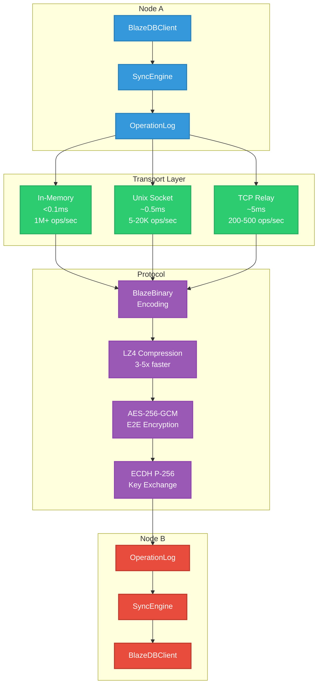

**Transport Layers:**
- In-memory queue: Same process communication (<0.1ms latency)
- Unix domain socket: Cross-process, same device (~0.5ms latency)
- TCP relay: Network communication (~5ms local, 10–50ms remote)

**Protocol:**
BlazeBinary encoding is 53% smaller than JSON. Optional LZ4 compression is 3–5× faster than gzip. End-to-end encryption uses AES-256-GCM with ECDH P-256 key exchange. Secure handshake uses shared secret authentication.

---

## Future Work

Planned improvements:

**Query Optimizer:**
Cost-based query optimizer, statistics collection for better index selection, query plan caching. Current rule-based approach works, but cost model would be better.

**Distributed Features:**
Multi-master replication (experimental), automatic conflict resolution strategies, distributed transaction coordination. Complex area, proceeding carefully.

**Performance:**
Parallel index builds, incremental index updates, query result streaming. Optimizations that would help with large datasets.

**Platform:**
Enhanced Linux performance, Windows support (experimental), additional Secure Enclave integration. Linux works but isn't as optimized as Apple platforms.

**API:**
GraphQL query interface, REST API for remote access, additional migration tools. Would make integration easier.

---

## Versioning & Stability

**Current Version:** 2.5.0-alpha

**Versioning Strategy:**
Semantic versioning (MAJOR.MINOR.PATCH). Alpha releases mean APIs may change. Beta releases mean APIs are stable but implementation may change. Stable releases (1.0.0+) have full compatibility guarantees.

**Compatibility:**
Forward upgrade path means databases can be upgraded to newer versions. No forced deletion means existing databases are never automatically deleted. Migration support means format migrations are automatic and transparent.

**Support:**
Complete API reference and architecture docs available. GitHub Issues for bug reports and feature requests. Contributions welcome.

---

## Documentation

Complete documentation organized in `Docs/`:

- `Docs/MASTER_DOCUMENTATION_INDEX.md` - Complete documentation index
- `Docs/Architecture/` - System architecture and design
- `Docs/API/` - API reference and usage guides
- `Docs/Guides/` - Step-by-step guides
- `Docs/Performance/` - Performance analysis and optimization
- `Docs/Security/` - Security architecture and best practices
- `Docs/Sync/` - Distributed sync documentation
- `Docs/Testing/` - Test coverage and methodology

---

## Tools

BlazeDB includes a complete suite of tools:

- **BlazeShell:** Command-line REPL for database operations
- **BlazeDBVisualizer:** macOS app for monitoring, managing, and visualizing databases
- **BlazeStudio:** Visual schema designer with code generation
- **BlazeServer:** Standalone server for remote clients

See `Docs/Tools/` for complete documentation.

---

## Migration from Other Databases

### SQLite → BlazeDB

```swift
try BlazeMigrationTool.importFromSQLite(
 source: sqliteURL,
 destination: blazeURL,
 password: "your-password",
 tables: ["users", "posts", "comments"] // or nil for all tables
)
```

### Core Data → BlazeDB

```swift
try BlazeMigrationTool.importFromCoreData(
 container: container,
 destination: blazeURL,
 password: "your-password",
 entities: ["User", "Post", "Comment"] // or nil for all entities
)
```

See `Tools/` directory for migration implementations.

---

## Contributing

BlazeDB is part of Project Blaze. Contributions welcome!

---

## License

MIT License - See LICENSE file for details.

---

## Appendix

### BlazeBinary Protocol Specification

Detailed protocol specifications for implementers and debuggers.

### Record Format Structure

BlazeBinary records use a fixed 8-byte header followed by variable-length fields. Header aligned to 8 bytes for efficient CPU reads.

```

 HEADER (8 bytes, aligned) 

 Offset Size Type Description 
 0 5 char[5] Magic: "BLAZE" (0x42 0x4C 0x41...) 
 5 1 uint8 Version: 0x01 (v1) or 0x02 (v2) 
 6 2 uint16 Field count (big-endian) 

 FIELD_1 (variable length) 
 [KEY_ENCODING][VALUE_ENCODING] 

 FIELD_2 (variable length) 
 [KEY_ENCODING][VALUE_ENCODING] 

... 

 FIELD_N (variable length) 
 [KEY_ENCODING][VALUE_ENCODING] 

 CRC32 (4 bytes, v2 only, big-endian) 
 Only present if version == 0x02 

```

**Header Details:**
- **Magic Bytes:** "BLAZE" (0x42 0x4C 0x41 0x5A 0x45) for format validation
- **Version:** 0x01 (v1, no CRC) or 0x02 (v2, with CRC32)
- **Field Count:** UInt16 big-endian, pre-allocates dictionary capacity

### Field Encoding Details

Each field has a key encoding followed by a value encoding.

**Key Encoding (Two Variants):**

**Variant A: Common Field (1 byte)**
```

 1 byte: Field ID (0x01-0x7F) 

```

Top 127 most common field names (e.g., "id", "createdAt", "title") encoded as single byte.

**Variant B: Custom Field (3+N bytes)**
```

 1 byte: Marker (0xFF) 
 2 bytes: Key length (big-endian) 
 N bytes: UTF-8 key string 

```

Fields not in common dictionary use 0xFF marker.

**Example:**
- "id" → 0x01 (1 byte total)
- "myCustomField" → 0xFF + 0x000D + "myCustomField" (16 bytes total)

### Type System Reference

**Base Types:**
- `0x01`: String (full, 4-byte length + UTF-8)
- `0x02`: Int (full, 8 bytes big-endian)
- `0x03`: Double (8 bytes bitPattern big-endian)
- `0x04`: Bool (1 byte: 0x01 true, 0x00 false)
- `0x05`: UUID (16 bytes binary)
- `0x06`: Date (8 bytes TimeInterval big-endian)
- `0x07`: Data (4-byte length + N bytes)
- `0x08`: Array (2-byte count + recursive items)
- `0x09`: Dictionary (2-byte count + sorted key-value pairs)
- `0x0A`: Vector (4-byte count + N*4 bytes Float32)
- `0x0B`: Null (0 bytes)

**Optimizations:**
- `0x11`: Empty String (1 byte total)
- `0x12`: Small Int (0-255, 2 bytes total vs 9 for full int)
- `0x18`: Empty Array (1 byte total)
- `0x19`: Empty Dictionary (1 byte total)
- `0x20-0x2F`: Inline String (type + length in 1 byte, length ≤15)

### Value Encoding Examples

**String Encoding:**

Empty string:
```
[0x11] (1 byte total)
```

Inline string (≤15 bytes):
```
[0x20 | length] [UTF-8 bytes]
Example: "Hello" (5 bytes) → [0x25] [0x48 0x65 0x6C 0x6C 0x6F]
```

Full string (>15 bytes):
```
[0x01] [length:4 bytes BE] [UTF-8 bytes]
Example: "Hello, world!" → [0x01] [0x0000000D] [0x48 0x65 0x6C 0x6C 0x6F 0x2C 0x20 0x77 0x6F 0x72 0x6C 0x64 0x21]
```

**Integer Encoding:**

Small int (0-255):
```
[0x12] [value:1 byte]
Example: 42 → [0x12] [0x2A]
```

Full int:
```
[0x02] [value:8 bytes BE]
Example: 1000 → [0x02] [0x00 0x00 0x00 0x00 0x00 0x00 0x03 0xE8]
```

**Array Encoding:**

Empty array:
```
[0x18] (1 byte total)
```

Non-empty array:
```
[0x08] [count:2 bytes BE] [item1] [item2]... [itemN]
```

**Dictionary Encoding:**

Empty dictionary:
```
[0x19] (1 byte total)
```

Non-empty dictionary:
```
[0x09] [count:2 bytes BE] [key1][value1] [key2][value2]... [keyN][valueN]
```

Keys sorted before encoding for deterministic output.

**Complete Record Example:**

**Input:**
```swift
BlazeDataRecord([
 "id":.uuid(UUID(...)),
 "title":.string("Hello"),
 "count":.int(42),
 "active":.bool(true)
])
```

**Binary Encoding (hexadecimal):**
```
42 4C 41 5A 45 02 00 04 // Header: "BLAZE" + v2 + 4 fields
01 // Field 1 key: "id" (common field 0x01)
05 [16 bytes UUID] // Field 1 value: UUID type + 16 bytes
06 // Field 2 key: "title" (common field 0x06)
25 48 65 6C 6C 6F // Field 2 value: Inline string "Hello" (0x25 = 0x20|5)
2F // Field 3 key: "count" (common field 0x2F)
12 2A // Field 3 value: Small int 42 (0x12 + 0x2A)
23 // Field 4 key: "active" (common field 0x23)
04 01 // Field 4 value: Bool true (0x04 + 0x01)
[CRC32: 4 bytes] // CRC32 checksum (v2 only)
```

**Size Comparison:**
- JSON: ~120 bytes
- BlazeBinary: ~40 bytes (67% smaller)

### Network Frame Structure

For network sync, BlazeBinary records are wrapped in frames:

```

 FRAME HEADER (5 bytes) 

 1 byte: Frame Type (0x01-0x06) 
 4 bytes: Payload Length (big-endian UInt32) 

 PAYLOAD (variable length) 
 Encrypted with AES-256-GCM (if handshaked) 
 Or plaintext (during handshake) 

```

**Frame Types:**
- `0x01`: handshake
- `0x02`: handshakeAck
- `0x03`: verify
- `0x04`: handshakeComplete
- `0x05`: encryptedData
- `0x06`: operation
